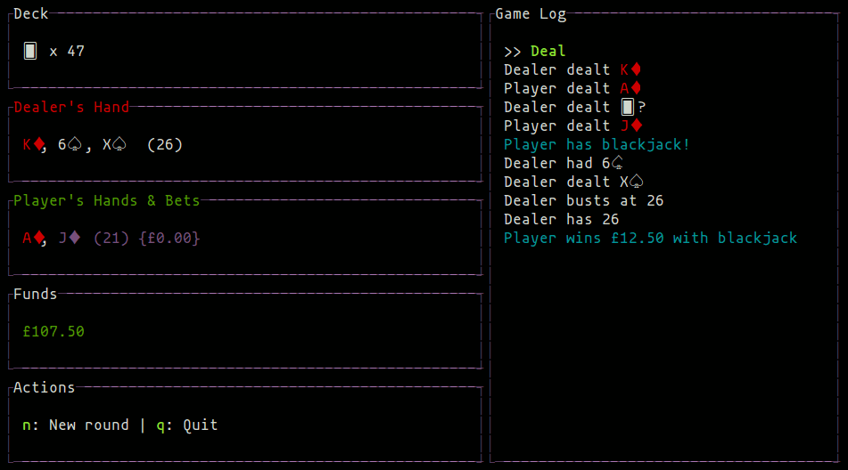

Blackjack
=========

[](https://travis-ci.org/hughgrigg/blackjack)
[](https://goreportcard.com/report/github.com/hughgrigg/blackjack)
[](https://coveralls.io/github/hughgrigg/blackjack?branch=master)

This is an implementation of the
[blackjack](https://en.wikipedia.org/wiki/Blackjack) casino game in Go. This
game is also known as twenty-one.

The game uses a single
[52-card deck](https://en.wikipedia.org/wiki/Standard_52-card_deck).



## Tests

You can run all the tests with:

```bash
go get github.com/stretchr/testify/assert
go test -v ./...
```

Or for nicer output:

```bash
go get -u github.com/kyoh86/richgo
richgo test -v ./...
```

For code coverage:

```bash
go get golang.org/x/tools/cmd/cover
for p in cards game ui util; do go test -coverprofile cover.out ./${p}; done
```
